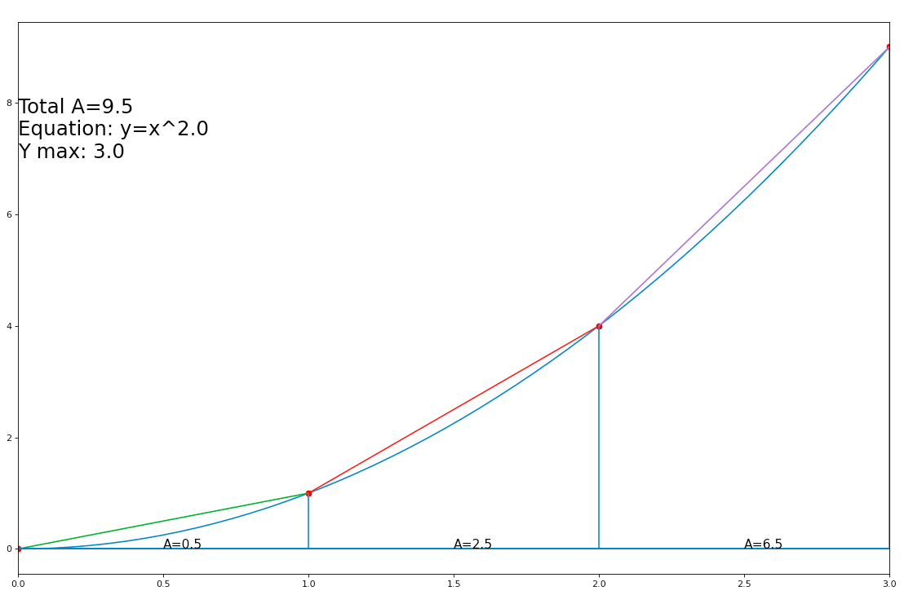

# Riemann Sum Demomonstration
A Python program to visually demonstrate the Riemann Sum.

## Running the program

    python3 main.py [limit] [interval] [exponent] [y_intercept]

The following inputs, in the form of command-line arguments, are required.

* `limit` (maximum x value)
* `interval`
* `exponent` (y = x^`exponent`)
* `y_intercept`